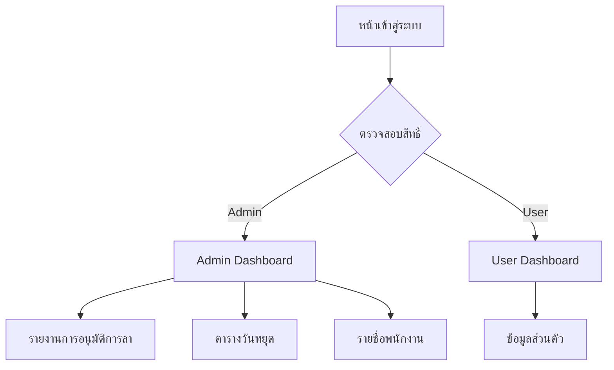

## 1. ภาพรวมผลิตภัณฑ์

ระบบ Dashboard สำหรับการจัดการพนักงานที่มีการแยกสิทธิ์การใช้งานระหว่างผู้ดูแลระบบและผู้ใช้งานทั่วไป ระบบนี้ช่วยให้องค์กรสามารถจัดการข้อมูลพนักงาน การลา และวันหยุดได้อย่างมีประสิทธิภาพ โดยมีการควบคุมสิทธิ์การเข้าถึงข้อมูลตามบทบาทของผู้ใช้งาน

## 2. ฟีเจอร์หลัก

### 2.1 บทบาทผู้ใช้งาน

| บทบาท                  | วิธีการลงทะเบียน                                                                                                                | สิทธิ์หลัก                                                                |
| ---------------------- | ------------------------------------------------------------------------------------------------------------------------------- | ------------------------------------------------------------------------- |
| ผู้ดูแลระบบ (Admin)    | อีเมลที่กำหนดไว้เท่านั้น: <adm001@bunny.com>, <admin@bunny.com>, <adm002@bunny.com>, <manager1@bunny.com>, <manager2@bunny.com> | เข้าถึง Dashboard ผู้ดูแลระบบ จัดการรายงานทั้งหมด แก้ไขข้อมูลได้ทุกรายการ |
| ผู้ใช้งานทั่วไป (User) | ลงทะเบียนผ่านระบบ                                                                                                               | เข้าถึง Dashboard ผู้ใช้งาน ดูข้อมูลส่วนตัวเท่านั้น                       |

### 2.2 โมดูลฟีเจอร์

ระบบ Dashboard การจัดการพนักงานประกอบด้วยหน้าหลักดังนี้:

1. **หน้าเข้าสู่ระบบ**: ระบบยืนยันตัวตน การตรวจสอบสิทธิ์อัตโนมัติ
2. **Dashboard ผู้ดูแลระบบ**: ภาพรวมระบบ เมนูการจัดการรายงาน การแจ้งเตือน
3. **Dashboard ผู้ใช้งาน**: ข้อมูลส่วนตัว สิทธิ์การใช้งานที่จำกัด
4. **หน้าจัดการรายงานการอนุมัติการลา**: แสดงรายการขอลา อนุมัติ/ปฏิเสธ
5. **หน้าจัดการตารางวันหยุด**: แสดงและแก้ไขวันหยุดประจำปี
6. **หน้าจัดการรายชื่อพนักงาน**: แสดงและแก้ไขข้อมูลพนักงาน

### 2.3 รายละเอียดหน้าเพจ

| ชื่อหน้า                        | โมดูล              | คำอธิบายฟีเจอร์                                                                            |
| ------------------------------- | ------------------ | ------------------------------------------------------------------------------------------ |
| หน้าเข้าสู่ระบบ                 | ฟอร์มเข้าสู่ระบบ   | กรอกอีเมลและรหัสผ่าน ระบบตรวจสอบสิทธิ์อัตโนมัติและเปลี่ยนเส้นทางไปยัง Dashboard ที่เหมาะสม |
| Dashboard ผู้ดูแลระบบ           | ภาพรวมระบบ         | แสดงสถิติการลา จำนวนพนักงาน การแจ้งเตือนรออนุมัติ                                          |
| Dashboard ผู้ดูแลระบบ           | เมนูการจัดการ      | ลิงก์ไปยังหน้ารายงานต่างๆ รายงานการอนุมัติการลา ตารางวันหยุด รายชื่อพนักงาน                |
| Dashboard ผู้ดูแลระบบ           | ระบบแจ้งเตือน      | แสดงการแจ้งเตือนเมื่อมีการร้องขอที่ต้องอนุมัติ                                             |
| Dashboard ผู้ใช้งาน             | ข้อมูลส่วนตัว      | แสดงข้อมูลพนักงาน วันลาคงเหลือ ประวัติการลา                                                |
| หน้าจัดการรายงานการอนุมัติการลา | รายการขอลา         | แสดงรายการขอลาทั้งหมด สถานะการอนุมัติ                                                      |
| หน้าจัดการรายงานการอนุมัติการลา | การอนุมัติ/ปฏิเสธ  | คลิกเพื่ออนุมัติหรือปฏิเสธการลา ระบบบันทึกการตัดสินใจ                                      |
| หน้าจัดการตารางวันหยุด          | ตารางวันหยุด       | แสดงวันหยุดประจำปีในรูปแบบปฏิทิน                                                           |
| หน้าจัดการตารางวันหยุด          | แก้ไขวันหยุด       | เพิ่ม ลบ หรือแก้ไขวันหยุด                                                                  |
| หน้าจัดการรายชื่อพนักงาน        | รายชื่อพนักงาน     | แสดงรายชื่อพนักงานทั้งหมด พร้อมข้อมูลติดต่อ                                                |
| หน้าจัดการรายชื่อพนักงาน        | แก้ไขข้อมูลพนักงาน | คลิกเพื่อแก้ไขข้อมูลส่วนตัว ตำแหน่งงาน แผนก                                                |

## 3. กระบวนการหลัก

**กระบวนการเข้าสู่ระบบ:**

1. ผู้ใช้งานกรอกอีเมลและรหัสผ่าน
2. ระบบตรวจสอบว่าอีเมลอยู่ในรายชื่อผู้ดูแลระบบหรือไม่
3. หากเป็น Admin -> เปลี่ยนเส้นทางไปยัง Admin Dashboard
4. หากเป็น User -> เปลี่ยนเส้นทางไปยัง User Dashboard
5. บันทึก Log การเข้าใช้งาน

**กระบวนการจัดการรายงาน (Admin):**

1. Admin เข้าสู่ Dashboard
2. คลิกเลือกรายงานที่ต้องการจัดการ
3. ระบบแสดงข้อมูลรายงาน
4. Admin แก้ไขข้อมูลตามต้องการ
5. ระบบบันทึกการเปลี่ยนแปลง

## 4. การออกแบบส่วนติดต่อผู้ใช้

### 4.1 สไตล์การออกแบบ

* **สีหลัก**: #2563eb (สีน้ำเงินเข้ม) - ใช้สำหรับพื้นหลังหลักและปุ่มสำคัญ

* **สีรอง**: #f3f4f6 (สีเทาอ่อน) - ใช้สำหรับพื้นหลังรองและการแบ่งส่วน

* **สี accent**: #10b981 (สีเขียว) - ใช้สำหรับการแจ้งเตือนสถานะสำเร็จ

* **สี warning**: #f59e0b (สีส้ม) - ใช้สำหรับการแจ้งเตือนและสถานะรอดำเนินการ

* **สี danger**: #ef4444 (สีแดง) - ใช้สำหรับสถานะถูกปฏิเสธและการลบ

* **รูปแบบปุ่ม**: ปุ่มแบบ rounded มุมโค้ง 8px พร้อมเงาเล็กน้อย

* **ฟอนต์**: Inter, sans-serif ขนาด 16px สำหรับเนื้อหาหลัก

* **รูปแบบ Layout**: แบบ sidebar navigation สำหรับ desktop และ bottom navigation สำหรับ mobile

* **ไอคอน**: ใช้ไอคอนแบบ outline จาก Heroicons

### 4.2 ภาพรวมการออกแบบหน้าเพจ

| ชื่อหน้า        | โมดูล            | องค์ประกอบ UI                                                                        |
| --------------- | ---------------- | ------------------------------------------------------------------------------------ |
| หน้าเข้าสู่ระบบ | ฟอร์มเข้าสู่ระบบ | กล่องกรอกข้อมูลกึ่งกลางหน้าจอ สีพื้นหลังไล่เฉดสีน้ำเงิน ปุ่มเข้าสู่ระบบสีน้ำเงินเข้ม |
| Admin Dashboard | ภาพรวมระบบ       | การ์ดแสดงสถิติ 4 ใบเรียงกัน กราฟแท่งแสดงข้อมูล ตารางแสดงรายการล่าสุด                 |
| Admin Dashboard | เมนูการจัดการ    | Sidebar ด้านซ้าย สีเทาอ่อน ไอคอนเมนูแบบ outline                                      |
| User Dashboard  | ข้อมูลส่วนตัว    | การ์ดโปรไฟล์พนักงาน ตารางแสดงวันลาคงเหลือ ประวัติการลาแบบ timeline                   |

### 4.3 การรองรับอุปกรณ์ต่างๆ

* **Desktop-first**: ออกแบบสำหรับหน้าจอขนาด 1280px ขึ้นไปก่อน

* **Mobile-adaptive**: รองรับหน้าจอขนาด 375px ขึ้นไป ด้วย responsive breakpoints

* **Touch interaction**: ปรับขนาดปุ่มและช่องกรอกข้อมูลให้เหมาะสมกับการสัมผัสบน

