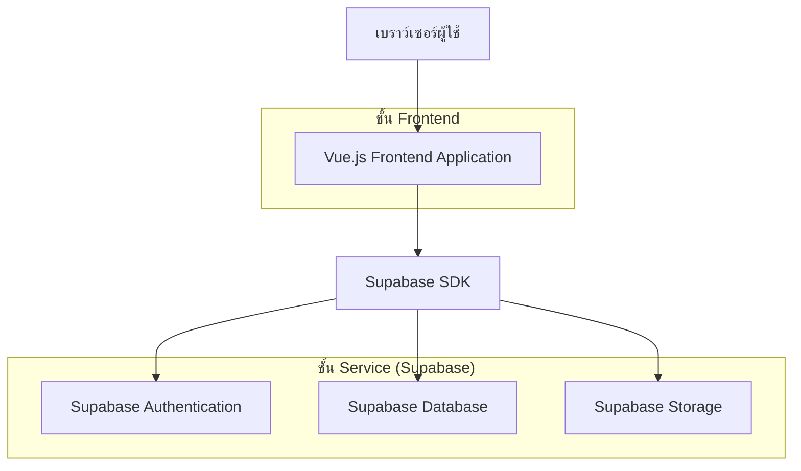
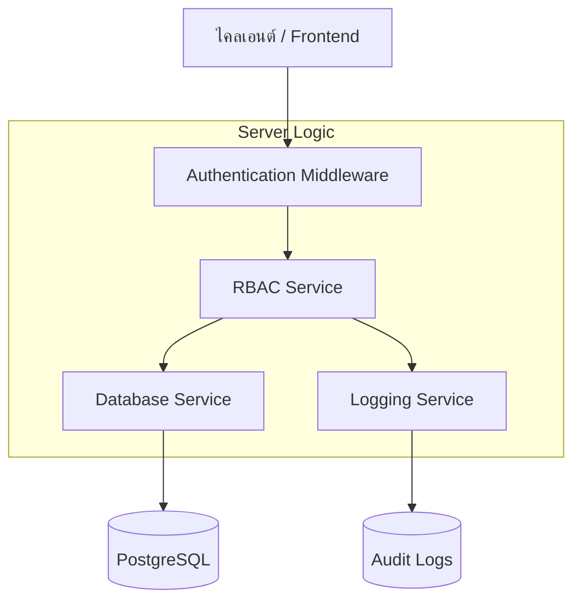
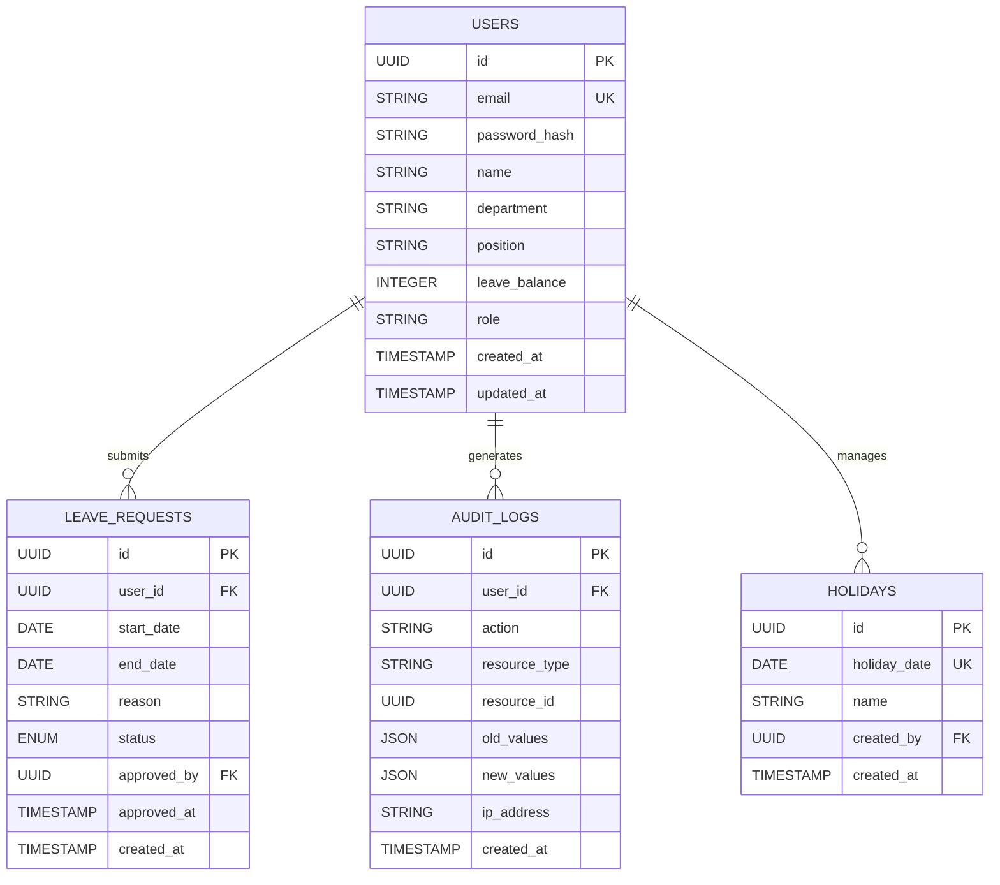

## 1. การออกแบบสถาปัตยกรรม



## 2. รายละเอียดเทคโนโลยี

* Frontend: Vue.js\@3 + Tailwind CSS\@3 + Vite

* Initialization Tool: vite-init

* Backend: Supabase (Backend-as-a-Service)

* Database: PostgreSQL (ผ่าน Supabase)

* Authentication: Supabase Auth

* Real-time: Supabase Realtime subscriptions

## 3. การกำหนดเส้นทาง (Route definitions)

| เส้นทาง                 | วัตถุประสงค์                               |
| ----------------------- | ------------------------------------------ |
| /login                  | หน้าเข้าสู่ระบบ สำหรับยืนยันตัวตนของผู้ใช้ |
| /admin/dashboard        | หน้า Dashboard ผู้ดูแลระบบ แสดงภาพรวมระบบ  |
| /admin/leave-reports    | หน้าจัดการรายงานการอนุมัติการลา            |
| /admin/holiday-calendar | หน้าจัดการตารางวันหยุดประจำปี              |
| /admin/employee-list    | หน้าจัดการรายชื่อพนักงาน                   |
| /user/dashboard         | หน้า Dashboard ผู้ใช้งาน แสดงข้อมูลส่วนตัว |
| /unauthorized           | หน้าแจ้งเตือนเมื่อไม่มีสิทธิ์เข้าถึง       |

## 4. การกำหนด API (API definitions)

### 4.1 Authentication APIs

```
POST /auth/v1/token
```

Request:

| ชื่อพารามิเตอร์ | ประเภท | บังคับ | คำอธิบาย       |
| --------------- | ------ | ------ | -------------- |
| email           | string | true   | อีเมลของผู้ใช้ |
| password        | string | true   | รหัสผ่าน       |

Response:

```json
{
  "access_token": "eyJhbGciOiJIUzI1NiIsInR5cCI6IkpXVCJ9...",
  "token_type": "bearer",
  "expires_in": 3600,
  "refresh_token": "tGzvJIZN_3sBY8NHMqOaHLz",
  "user": {
    "id": "123e4567-e89b-12d3-a456-426614174000",
    "email": "user@example.com",
    "role": "admin"
  }
}
```

### 4.2 User Management APIs

```
GET /rest/v1/users
```

Response:

```json
[
  {
    "id": "123e4567-e89b-12d3-a456-426614174000",
    "email": "employee@company.com",
    "name": "สมชาย ใจดี",
    "department": "ฝ่ายขาย",
    "position": "พนักงานขาย",
    "leave_balance": 10,
    "created_at": "2024-01-15T00:00:00Z"
  }
]
```

### 4.3 Leave Management APIs

```
GET /rest/v1/leave_requests
```

Response:

```json
[
  {
    "id": "req_001",
    "user_id": "123e4567-e89b-12d3-a456-426614174000",
    "start_date": "2024-02-10",
    "end_date": "2024-02-12",
    "reason": "ลาพักผ่อน",
    "status": "pending",
    "requested_at": "2024-01-20T10:00:00Z"
  }
]
```

## 5. แผนภาพสถาปัตยกรรมเซิร์ฟเวอร์



## 6. โมเดลข้อมูล (Data Model)

### 6.1 การกำหนดโมเดลข้อมูล



### 6.2 ภาษากำหนดข้อมูล (DDL)

**ตารางผู้ใช้งาน (users)**

```sql
-- สร้างตาราง
CREATE TABLE users (
    id UUID PRIMARY KEY DEFAULT gen_random_uuid(),
    email VARCHAR(255) UNIQUE NOT NULL,
    password_hash VARCHAR(255) NOT NULL,
    name VARCHAR(100) NOT NULL,
    department VARCHAR(100),
    position VARCHAR(100),
    leave_balance INTEGER DEFAULT 0,
    role VARCHAR(20) DEFAULT 'user' CHECK (role IN ('admin', 'user')),
    created_at TIMESTAMP WITH TIME ZONE DEFAULT NOW(),
    updated_at TIMESTAMP WITH TIME ZONE DEFAULT NOW()
);

-- สร้างดัชนี
CREATE INDEX idx_users_email ON users(email);
CREATE INDEX idx_users_role ON users(role);

-- ข้อมูลเริ่มต้นสำหรับผู้ดูแลระบบ
INSERT INTO users (email, password_hash, name, role) VALUES
('adm001@bunny.com', '$2b$10$YourHashedPasswordHere', 'Admin User 1', 'admin'),
('admin@bunny.com', '$2b$10$YourHashedPasswordHere', 'Main Admin', 'admin'),
('adm002@bunny.com', '$2b$10$YourHashedPasswordHere', 'Admin User 2', 'admin'),
('manager1@bunny.com', '$2b$10$YourHashedPasswordHere', 'Manager 1', 'admin'),
('manager2@bunny.com', '$2b$10$YourHashedPasswordHere', 'Manager 2', 'admin');
```

**ตารางคำขอลา (leave\_requests)**

```sql
-- สร้างตาราง
CREATE TABLE leave_requests (
    id UUID PRIMARY KEY DEFAULT gen_random_uuid(),
    user_id UUID REFERENCES users(id) ON DELETE CASCADE,
    start_date DATE NOT NULL,
    end_date DATE NOT NULL,
    reason TEXT NOT NULL,
    status VARCHAR(20) DEFAULT 'pending' CHECK (status IN ('pending', 'approved', 'rejected')),
    approved_by UUID REFERENCES users(id),
    approved_at TIMESTAMP WITH TIME ZONE,
    created_at TIMESTAMP WITH TIME ZONE DEFAULT NOW(),
    updated_at TIMESTAMP WITH TIME ZONE DEFAULT NOW()
);

-- สร้างดัชนี
CREATE INDEX idx_leave_requests_user_id ON leave_requests(user_id);
CREATE INDEX idx_leave_requests_status ON leave_requests(status);
CREATE INDEX idx_leave_requests_created_at ON leave_requests(created_at DESC);
```

**ตารางวันหยุด (holidays)**

```sql
-- สร้างตาราง
CREATE TABLE holidays (
    id UUID PRIMARY KEY DEFAULT gen_random_uuid(),
    holiday_date DATE UNIQUE NOT NULL,
    name VARCHAR(200) NOT NULL,
    created_by UUID REFERENCES users(id),
    created_at TIMESTAMP WITH TIME ZONE DEFAULT NOW()
);

-- สร้างดัชนี
CREATE INDEX idx_holidays_date ON holidays(holiday_date);
```

**ตารางบันทึกการใช้งาน (audit\_logs)**

```sql
-- สร้างตาราง
CREATE TABLE audit_logs (
    id UUID PRIMARY KEY DEFAULT gen_random_uuid(),
    user_id UUID REFERENCES users(id),
    action VARCHAR(100) NOT NULL,
    resource_type VARCHAR(50) NOT NULL,
    resource_id UUID,
    old_values JSONB,
    new_values JSONB,
    ip_address INET,
    created_at TIMESTAMP WITH TIME ZONE DEFAULT NOW()
);

-- สร้างดัชนี
CREATE INDEX idx_audit_logs_user_id ON audit_logs(user_id);
CREATE INDEX idx_audit_logs_created_at ON audit_logs(created_at DESC);
CREATE INDEX idx_audit_logs_resource ON audit_logs(resource_type, resource_id);
```

### 6.3 การตั้งค่าสิทธิ์ของ Supabase (Row Level Security)

```sql
-- เปิดใช้งาน RLS สำหรับทุกตาราง
ALTER TABLE users ENABLE ROW LEVEL SECURITY;
ALTER TABLE leave_requests ENABLE ROW LEVEL SECURITY;
ALTER TABLE holidays ENABLE ROW LEVEL SECURITY;
ALTER TABLE audit_logs ENABLE ROW LEVEL SECURITY;

-- นโยบายสำหรับตาราง users
-- ผู้ใช้ทั่วไปสามารถดูข้อมูลตัวเองได้
CREATE POLICY "Users can view own profile" ON users
    FOR SELECT USING (auth.uid() = id);

-- ผู้ดูแลระบบสามารถดูและแก้ไขข้อมูลทั้งหมดได้
CREATE POLICY "Admins can manage all users" ON users
    FOR ALL USING (
        EXISTS (
            SELECT 1 FROM users 
            WHERE id = auth.uid() AND role = 'admin'
        )
    );

-- นโยบายสำหรับตาราง leave_requests
-- ผู้ใช้ทั่วไปสามารถดูคำขอของตัวเองได้
CREATE POLICY "Users can view own leave requests" ON leave_requests
    FOR SELECT USING (auth.uid() = user_id);

-- ผู้ดูแลระบบสามารถจัดการคำขอทั้งหมดได้
CREATE POLICY "Admins can manage all leave requests" ON leave_requests
    FOR ALL USING (
        EXISTS (
            SELECT 1 FROM users 
            WHERE id = auth.uid() AND role = 'admin'
        )
    );

-- นโยบายสำหรับตาราง holidays
-- ทุกคนสามารถดูวันหยุดได้
CREATE POLICY "Everyone can view holidays" ON holidays
    FOR SELECT USING (true);

-- ผู้ดูแลระบบสามารถจัดการวันหยุดได้
CREATE POLICY "Admins can manage holidays" ON holidays
    FOR ALL USING (
        EXISTS (
            SELECT 1 FROM users 
            WHERE id = auth.uid() AND role = 'admin'
        )
    );

-- มอบสิทธิ์พื้นฐานให้กับบทบาท anon และ authenticated
GRANT SELECT ON users TO anon;
GRANT ALL ON users TO authenticated;
GRANT SELECT ON leave_requests TO anon;
GRANT ALL ON leave_requests TO authenticated;
GRANT SELECT ON holidays TO anon;
GRANT ALL ON holidays TO authenticated;
GRANT SELECT ON audit_logs TO authenticated;
```

