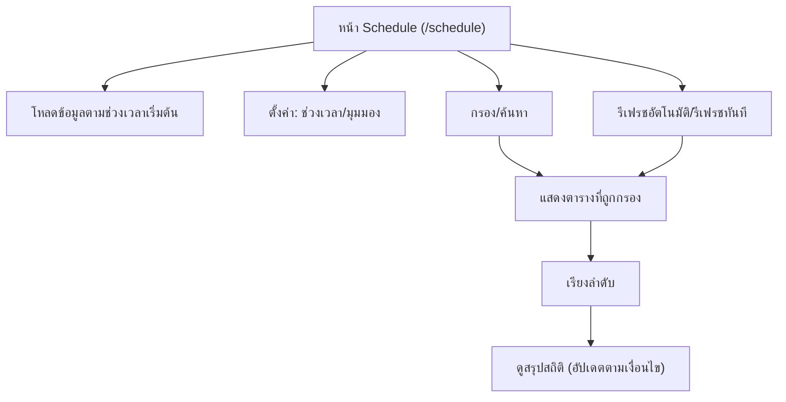

## 1. Product Overview
หน้า **/schedule** แสดง “ตารางพนักงานที่ลาหยุด” แบบอ่านง่าย เพื่อให้คุณตรวจภาพรวมกำลังคนและการลาหยุดได้เร็ว
รองรับ **กรอง/ค้นหา/เรียง/สรุปสถิติ** และ **รีเฟรชอัตโนมัติ** เพื่อให้ข้อมูลล่าสุดอยู่เสมอ

## 2. Core Features

### 2.1 Feature Module
ความต้องการหลักประกอบด้วยหน้าเดียว:
1. **หน้า Schedule (ตารางการลาหยุด)**: เลือกช่วงเวลาและมุมมอง, กรอง/ค้นหา/เรียง, ตารางลาหยุดแบบอ่านง่าย, สรุปสถิติ, รีเฟรชอัตโนมัติ + สถานะล่าสุด

### 2.2 Page Details
| Page Name | Module Name | Feature description |
|-----------|-------------|---------------------|
| หน้า Schedule (/schedule) | ส่วนหัว + ตัวควบคุมช่วงเวลา | เลือกช่วงวันที่ (เช่น สัปดาห์/เดือน) และสลับมุมมอง (วัน/สัปดาห์/เดือน) เพื่ออ่านตารางได้เหมาะกับงาน |
| หน้า Schedule (/schedule) | ค้นหา | ค้นหาพนักงานด้วยคำค้น (เช่น ชื่อ/รหัส) และแสดงผลแบบเรียลไทม์/กดค้นหา |
| หน้า Schedule (/schedule) | ตัวกรอง | กรองรายการตามเงื่อนไขที่จำเป็นต่อการดูตาราง (เช่น หน่วยงาน/ทีม/ประเภทการลา/สถานะ) และมีปุ่มล้างตัวกรอง |
| หน้า Schedule (/schedule) | การเรียงลำดับ | เรียงตามคอลัมน์สำคัญ (เช่น ชื่อพนักงาน, จำนวนวันลาในช่วง, วันที่เริ่มลา) พร้อมตัวบอกทิศทาง asc/desc |
| หน้า Schedule (/schedule) | ตารางลาหยุดแบบอ่านง่าย | แสดงตารางหลักแบบ roster/calendar: แถวเป็นพนักงาน คอลัมน์เป็นวัน/ช่วงเวลา; ทำสี/ป้ายกำกับประเภทการลา; รองรับเลื่อนแนวนอน/แนวตั้ง; ส่วนหัวตารางคงที่ (sticky) |
| หน้า Schedule (/schedule) | Legend/คำอธิบายสี | แสดงคำอธิบายสีและสัญลักษณ์ของประเภทการลา/สถานะ เพื่อให้คุณตีความตารางได้ทันที |
| หน้า Schedule (/schedule) | สรุปสถิติ | สรุปจำนวนพนักงานที่ลาหยุด, จำนวนวันลารวม, แจกแจงตามประเภทการลา/สถานะ และอัปเดตตามตัวกรอง/ช่วงเวลา |
| หน้า Schedule (/schedule) | รีเฟรชอัตโนมัติ | รีเฟรชข้อมูลตามรอบเวลา (เช่น ทุก N วินาที) แสดง “อัปเดตล่าสุดเมื่อ…” และสถานะกำลังอัปเดต/อัปเดตสำเร็จ/ล้มเหลว |
| หน้า Schedule (/schedule) | สถานะโหลด/ว่าง/ผิดพลาด | แสดง skeleton/loading, empty state เมื่อไม่มีข้อมูล, และข้อความผิดพลาดที่บอกสาเหตุ/แนวทางลองใหม่ (พร้อมปุ่มรีเฟรชทันที) |

## 3. Core Process
**Flow ของคุณบนหน้า Schedule**
1) คุณเปิดหน้า /schedule ระบบโหลดข้อมูลตามช่วงเวลาเริ่มต้น
2) คุณปรับช่วงเวลา/มุมมองเพื่อให้ตารางอ่านง่ายตามบริบทงาน
3) คุณใช้ตัวกรองและค้นหาเพื่อลดข้อมูลให้เหลือเฉพาะที่ต้องการ
4) คุณเรียงลำดับเพื่อหา “คน/ทีม” ที่เกี่ยวข้องเร็วขึ้น
5) คุณดูสรุปสถิติที่อัปเดตตามเงื่อนไขล่าสุด
6) ระบบรีเฟรชอัตโนมัติตามรอบ และแสดงเวลาอัปเดตล่าสุด (คุณกดรีเฟรชทันทีได้)

