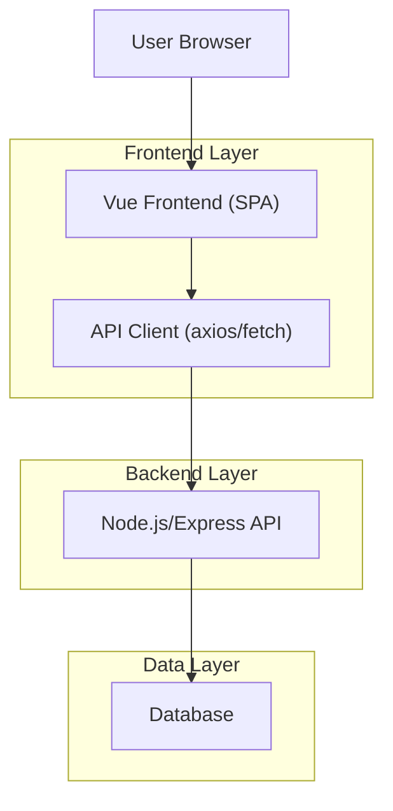
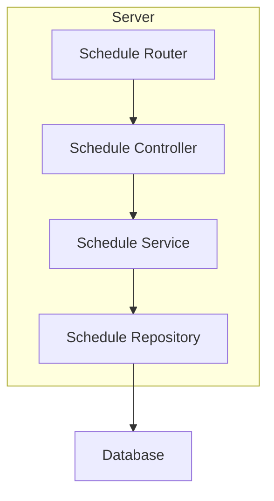
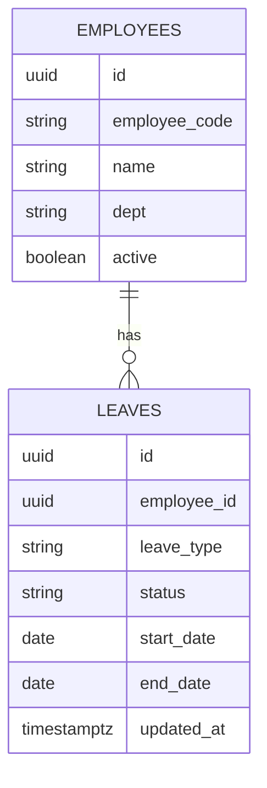

## 1.Architecture design


## 2.Technology Description
- Frontend: Vue@3 + vue-router + (Pinia หรือ store เดิมของโปรเจกต์) + axios/fetch
- Backend: Node.js + Express
- Database: ใช้ฐานข้อมูลเดิมของระบบ (เก็บพนักงานและรายการลาหยุด)

## 3.Route definitions
| Route | Purpose |
|-------|---------|
| /schedule | แสดงตารางพนักงานที่ลาหยุด พร้อมกรอง/ค้นหา/เรียง/สรุปสถิติ และรีเฟรชอัตโนมัติ |

## 4.API definitions
### 4.1 Schedule Overview (ตาราง + สถิติในครั้งเดียว)
```
GET /api/schedule
```
Query:
| Param Name | Param Type | isRequired | Description |
|-----------|------------|-----------:|-------------|
| start | string (YYYY-MM-DD) | true | วันที่เริ่มช่วงที่ต้องการแสดง |
| end | string (YYYY-MM-DD) | true | วันที่สิ้นสุดช่วงที่ต้องการแสดง |
| view | 'day' \| 'week' \| 'month' | false | โหมดการแสดงผล (ค่าเริ่มต้นตาม UI) |
| q | string | false | คำค้นหา (ชื่อ/รหัสพนักงาน) |
| dept | string | false | ตัวกรองหน่วยงาน/ทีม |
| leaveType | string | false | ตัวกรองประเภทการลา |
| status | string | false | ตัวกรองสถานะ |
| sortBy | 'name' \| 'leaveDays' \| 'startDate' | false | ฟิลด์ที่ใช้เรียง |
| sortDir | 'asc' \| 'desc' | false | ทิศทางการเรียง |
| since | string (ISO datetime) | false | ดึงเฉพาะกรณีมีอัปเดตหลังเวลานี้ (ช่วยลดงานตอน auto-refresh) |

Response (TypeScript):
```ts
type LeaveStatus = 'approved' | 'pending' | 'rejected' | 'cancelled'

type ScheduleLeaveBlock = {
  leaveId: string
  employeeId: string
  employeeCode: string
  employeeName: string
  dept?: string
  leaveType: string
  status: LeaveStatus
  startDate: string // YYYY-MM-DD
  endDate: string   // YYYY-MM-DD
  daysInRange: number
}

type ScheduleStats = {
  uniqueEmployeesOnLeave: number
  totalLeaveDaysInRange: number
  byLeaveType: Array<{ leaveType: string; count: number; days: number }>
  byStatus: Array<{ status: LeaveStatus; count: number }>
}

type ScheduleResponse = {
  rows: ScheduleLeaveBlock[]
  stats: ScheduleStats
  meta: {
    start: string
    end: string
    lastUpdatedAt: string // ISO datetime
  }
}
```

## 5.Server architecture diagram


## 6.Data model(if applicable)
### 6.1 Data model definition


### 6.2 Data Definition Language
Employees (employees)
```
CREATE TABLE employees (
  id UUID PRIMARY KEY DEFAULT gen_random_uuid(),
  employee_code VARCHAR(50) UNIQUE NOT NULL,
  name VARCHAR(200) NOT NULL,
  dept VARCHAR(200),
  active BOOLEAN DEFAULT TRUE,
  updated_at TIMESTAMP WITH TIME ZONE DEFAULT NOW()
);

CREATE INDEX idx_employees_dept ON employees(dept);
CREATE INDEX idx_employees_active ON employees(active);
```

Leaves (leaves)
```
CREATE TABLE leaves (
  id UUID PRIMARY KEY DEFAULT gen_random_uuid(),
  employee_id UUID NOT NULL,
  leave_type VARCHAR(100) NOT NULL,
  status VARCHAR(30) NOT NULL,
  start_date DATE NOT NULL,
  end_date DATE NOT NULL,
  updated_at TIMESTAMP WITH TIME ZONE DEFAULT NOW()
);

-- logical FK (ไม่บังคับด้วย constraint ตามแนวทางโปรเจกต์)
CREATE INDEX idx_leaves_employee_id ON leaves(employee_id);
CREATE INDEX idx_leaves_date_range ON leaves(start_date, end_date);
CREATE INDEX idx_leaves_status ON leaves(status);
CREATE INDEX idx_leaves_updated_at ON leaves(updated_at);
```