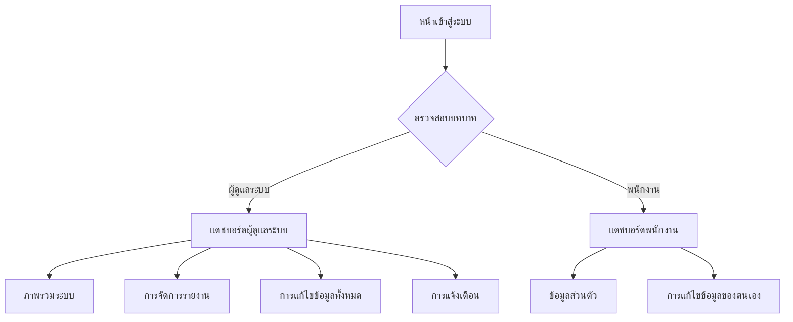

## 1. ภาพรวมผลิตภัณฑ์
ระบบจัดการพนักงานแบบครบวงจรที่ออกแบบสำหรับองค์กรขนาดกลางถึงใหญ่ ช่วยในการจัดการข้อมูลพนักงาน การรายงาน และการควบคุมการเข้าถึงข้อมูลตามบทบาท (RBAC) โดยมีแดชบอร์ดแยกสำหรับผู้ดูแลระบบและพนักงานทั่วไป

ปัญหาที่แก้ไข: การจัดการข้อมูลพนักงานแบบกระจัดกระจาย การเข้าถึงข้อมูลที่ไม่มีการควบคุม และการขาดระบบรายงานที่ครบถ้วน
ผู้ใช้งาน: ผู้ดูแลระบบ (Admin) และพนักงานทั่วไป (User)
คุณค่าทางตลาด: ลดเวลาในการบริหารจัดการข้อมูลพนักงาน 80% เพิ่มความปลอดภัยของข้อมูล และสร้างประสบการณ์การใช้งานที่ดีขึ้นสำหรับพนักงาน

## 2. ฟีเจอร์หลัก

### 2.1 บทบาทผู้ใช้งาน
| บทบาท | วิธีการลงทะเบียน | สิทธิ์การใช้งานหลัก |
|------|---------------------|------------------|
| ผู้ดูแลระบบ | อีเมลที่กำหนดไว้ล่วงหน้า (adm001@bunny.com, ฯลฯ) | เข้าถึงทุกฟีเจอร์ จัดการรายงาน แก้ไขข้อมูลทั้งหมด รับการแจ้งเตือน |
| พนักงานทั่วไป | อีเมลองค์กร + รหัสผ่าน | ดูข้อมูลส่วนตัว แก้ไขข้อมูลของตนเอง |

### 2.2 โมดูลฟีเจอร์
ระบบจัดการพนักงานของเราประกอบด้วยหน้าหลักดังนี้:
1. **หน้าเข้าสู่ระบบ**: ฟอร์มเข้าสู่ระบบ การตรวจสอบสิทธิ์ การเปลี่ยนเส้นทางอัตโนมัติ
2. **แดชบอร์ดผู้ดูแลระบบ**: ภาพรวมระบบ การจัดการรายงาน การแก้ไขข้อมูลทั้งหมด การแจ้งเตือน
3. **แดชบอร์ดพนักงาน**: ข้อมูลส่วนตัว การแก้ไขข้อมูลของตนเอง

### 2.3 รายละเอียดหน้าต่าง
| ชื่อหน้า | ชื่อโมดูล | คำอธิบายฟีเจอร์ |
|-----------|-------------|---------------------|
| หน้าเข้าสู่ระบบ | ฟอร์มเข้าสู่ระบบ | กรอกอีเมลและรหัสผ่าน ตรวจสอบความถูกต้อง แสดงข้อความผิดพลาด |
| หน้าเข้าสู่ระบบ | ระบบตรวจสอบสิทธิ์ | ตรวจสอบบทบาทผู้ใช้ เปลี่ยนเส้นทางไปยังแดชบอร์ดที่เหมาะสม |
| แดชบอร์ดผู้ดูแลระบบ | ภาพรวมระบบ | แสดงจำนวนพนักงานทั้งหมด สถิติการเข้าสู่ระบบ กราฟแนวโน้ม |
| แดชบอร์ดผู้ดูแลระบบ | การจัดการรายงาน | สร้าง ดู และดาวน์โหลดรายงานต่างๆ (PDF/Excel) กรองตามวันที่และแผนก |
| แดชบอร์ดผู้ดูแลระบบ | การแก้ไขข้อมูลทั้งหมด | เพิ่ม แก้ไข ลบข้อมูลพนักงาน จัดการแผนกและตำแหน่ง |
| แดชบอร์ดผู้ดูแลระบบ | การแจ้งเตือน | รับการแจ้งเตือนเมื่อมีการเปลี่ยนแปลงสำคัญ แสดงบนแดชบอร์ด |
| แดชบอร์ดพนักงาน | ข้อมูลส่วนตัว | แสดงรายละเอียดส่วนตัว วันเริ่มงาน ตำแหน่ง แผนก |
| แดชบอร์ดพนักงาน | การแก้ไขข้อมูลของตนเอง | แก้ไขเบอร์โทรศัพท์ ที่อยู่ รูปโปรไฟล์ |

## 3. กระบวนการหลัก
**กระบวนการเข้าสู่ระบบ:**
ผู้ใช้กรอกอีเมลและรหัสผ่าน → ระบบตรวจสอบความถูกต้อง → ตรวจสอบบทบาท → เปลี่ยนเส้นทางไปยังแดชบอร์ดผู้ดูแลระบบหรือแดชบอร์ดพนักงานตามลำดับ

**กระบวนการจัดการข้อมูลของผู้ดูแลระบบ:**
ผู้ดูแลระบบเข้าสู่ระบบ → ดูภาพรวมระบบ → เลือกการจัดการรายงานหรือแก้ไขข้อมูล → ทำการเปลี่ยนแปลง → บันทึกและรับการแจ้งเตือน

**กระบวนการจัดการข้อมูลส่วนตัวของพนักงาน:**
พนักงานเข้าสู่ระบบ → ดูข้อมูลส่วนตัว → คลิกแก้ไข → เปลี่ยนแปลงข้อมูล → บันทึก

## 4. การออกแบบส่วนติดต่อผู้ใช้
### 4.1 รูปแบบการออกแบบ
- **สีหลัก**: #1976D2 (สีน้ำเงิน Vuetify มาตรฐาน)
- **สีรอง**: #424242 (สีเทาเข้ม)
- **สีไฮไลท์**: #FF5252 (สีแดงสำหรับการแจ้งเตือน)
- **รูปแบบปุ่ม**: ปุ่มแบบยกระดับ (Elevated) ของ Vuetify มุมโค้งมน
- **ฟอนต์หลัก**: Roboto (ฟอนต์เริ่มต้นของ Material Design)
- **ขนาดฟอนต์ที่แนะนำ**: 14px สำหรับเนื้อหา, 16px สำหรับปุ่ม, 20px สำหรับหัวข้อ
- **รูปแบบเลย์เอาต์**: แบบการ์ด (Card-based) ใช้ VNavigationDrawer สำหรับเมนูด้านข้าง
- **ไอคอน**: Material Design Icons ผ่าน Vuetify

### 4.2 ภาพรวมการออกแบบหน้าต่าง
| ชื่อหน้า | ชื่อโมดูล | องค์ประกอบ UI |
|-----------|-------------|-------------|
| หน้าเข้าสู่ระบบ | ฟอร์มเข้าสู่ระบบ | VCard สีขาวพื้นหลังสีเทาอ่อน ช่องกรอกข้อความแบบ outlined ปุ่มสีหลัก ขนาด 400px |
| แดชบอร์ดผู้ดูแลระบบ | ภาพรวมระบบ | VRow/VCol สำหรับกริดการ์ด VCard แสดงสถิติ กราฟผ่าน VChart หรือ ApexCharts |
| แดชบอร์ดผู้ดูแลระบบ | การจัดการรายงาน | VDataTable สำหรับแสดงข้อมูล VBtn สำหรับดาวน์โหลด VMenu สำหรับตัวกรอง |
| แดชบอร์ดผู้ดูแลระบบ | การแก้ไขข้อมูลทั้งหมด | VDialog สำหรับฟอร์มแก้ไข VTextField VSelect สำหรับการเลือก VBtn สีหลักและรอง |
| แดชบอร์ดพนักงาน | ข้อมูลส่วนตัว | VAvatar สำหรับรูปโปรไฟล์ VList สำหรับแสดงรายละเอียด VCard แบบ flat |
| แดชบอร์ดพนักงาน | การแก้ไขข้อมูลของตนเอง | VForm แบบ stepper หรือแบบธรรมดา ตามความเหมาะสม validation ผ่าน Vuetify |

### 4.3 การตอบสนองต่ออุปกรณ์
ผลิตภัณฑ์นี้ออกแบบแบบ desktop-first แต่รองรับการปรับขนาดอัตโนมัติสำหรับแท็บเล็ตและมือถือ ใช้ Vuetify grid system (v-row, v-col) สำหรับการจัดวางที่ยืดหยุ่น มีการซ่อนเมนูด้านข้างอัตโนมัติบนอุปกรณ์ขนาดเล็ก (mobile navigation drawer) และปรับขนาดการ์ดและตารางให้เหมาะสมกับหน้าจอ