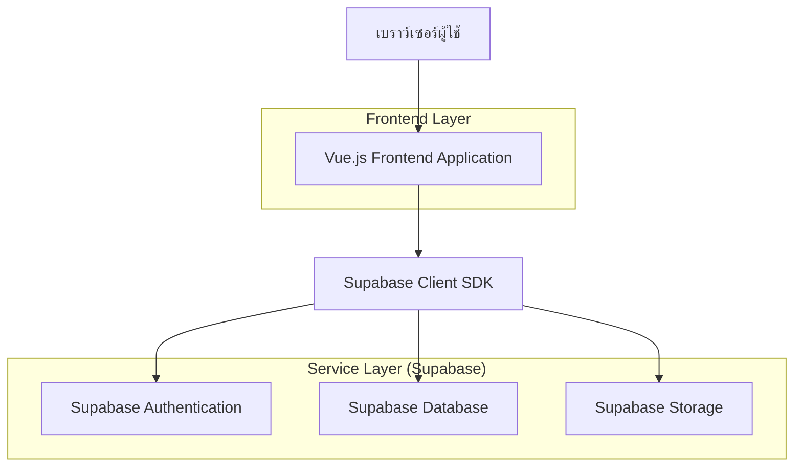
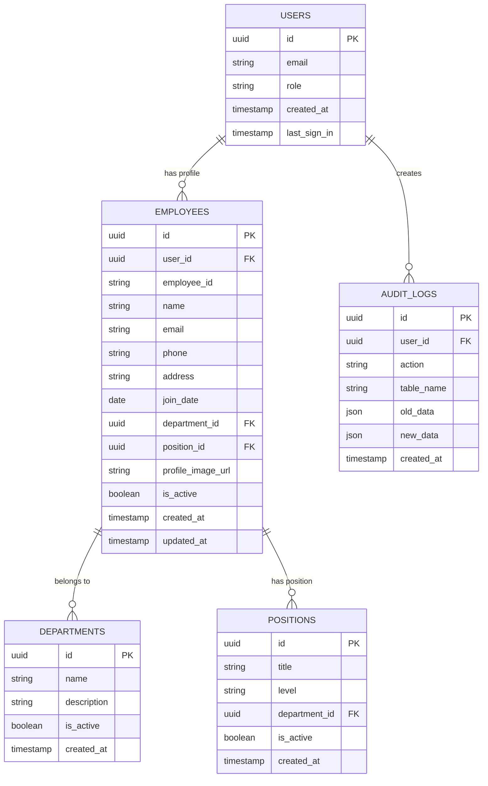

## 1. การออกแบบสถาปัตยกรรม



## 2. รายละเอียดเทคโนโลยี
- Frontend: Vue.js@3 + Vuetify@3 + Vite
- Initialization Tool: npm create vue@latest
- Backend: None (ใช้ Supabase โดยตรง)
- Database: Supabase (PostgreSQL)
- Authentication: Supabase Auth
- Storage: Supabase Storage (สำหรับรูปโปรไฟล์)

## 3. การกำหนดเส้นทาง (Routes)
| เส้นทาง | วัตถุประสงค์ |
|-------|---------|
| /login | หน้าเข้าสู่ระบบ รองรับการ authenticate ผ่าน Supabase |
| /admin/dashboard | แดชบอร์ดผู้ดูแลระบบ แสดงภาพรวมและสถิติ |
| /admin/reports | หน้าจัดการรายงาน สร้างและดาวน์โหลดรายงาน |
| /admin/employees | หน้าจัดการพนักงาน เพิ่ม แก้ไข ลบข้อมูล |
| /employee/profile | หน้าข้อมูลส่วนตัวของพนักงาน |
| /employee/edit-profile | หน้าแก้ไขข้อมูลส่วนตัว |
| /unauthorized | หน้าแจ้งเตือนเมื่อไม่มีสิทธิ์เข้าถึง |

## 4. การกำหนด API (ผ่าน Supabase)

### 4.1 การ authenticate ผ่าน Supabase
```javascript
// การเข้าสู่ระบบ
const { data, error } = await supabase.auth.signInWithPassword({
  email: email,
  password: password
})

// การออกจากระบบ
await supabase.auth.signOut()

// การตรวจสอบสถานะผู้ใช้ปัจจุบัน
const { data: { user } } = await supabase.auth.getUser()
```

### 4.2 การดึงข้อมูลพนักงาน
```javascript
// ดึงข้อมูลพนักงานทั้งหมด (สำหรับ admin)
const { data, error } = await supabase
  .from('employees')
  .select('*')
  .order('created_at', { ascending: false })

// ดึงข้อมูลพนักงานคนเดียว (สำหรับ user)
const { data, error } = await supabase
  .from('employees')
  .select('*')
  .eq('id', userId)
  .single()
```

### 4.3 การอัพเดทข้อมูล
```javascript
// Admin อัพเดทข้อมูลพนักงาน
const { data, error } = await supabase
  .from('employees')
  .update({ name: newName, department: newDept })
  .eq('id', employeeId)

// User อัพเดทข้อมูลตนเอง
const { data, error } = await supabase
  .from('employees')
  .update({ phone: newPhone, address: newAddress })
  .eq('id', currentUserId)
```

## 5. สถาปัตยกรรมเซิร์ฟเวอร์
เนื่องจากใช้ Supabase เป็น Backend-as-a-Service จึงไม่มีเซิร์ฟเวอร์ที่ต้องดูแลเอง ระบบจะใช้ Supabase Client SDK โดยตรงจาก Frontend

## 6. โมเดลข้อมูล

### 6.1 การกำหนดโมเดลข้อมูล


### 6.2 คำสั่ง SQL สำหรับสร้างตาราง

ตารางผู้ใช้ (users) - ใช้ auth.users ของ Supabase
```sql
-- ตารางพนักงาน (employees)
CREATE TABLE employees (
    id UUID PRIMARY KEY DEFAULT gen_random_uuid(),
    user_id UUID REFERENCES auth.users(id) ON DELETE CASCADE,
    employee_id VARCHAR(20) UNIQUE NOT NULL,
    name VARCHAR(100) NOT NULL,
    email VARCHAR(255) UNIQUE NOT NULL,
    phone VARCHAR(20),
    address TEXT,
    join_date DATE NOT NULL,
    department_id UUID REFERENCES departments(id),
    position_id UUID REFERENCES positions(id),
    profile_image_url TEXT,
    is_active BOOLEAN DEFAULT true,
    created_at TIMESTAMP WITH TIME ZONE DEFAULT NOW(),
    updated_at TIMESTAMP WITH TIME ZONE DEFAULT NOW()
);

-- ตารางแผนก (departments)
CREATE TABLE departments (
    id UUID PRIMARY KEY DEFAULT gen_random_uuid(),
    name VARCHAR(100) NOT NULL,
    description TEXT,
    is_active BOOLEAN DEFAULT true,
    created_at TIMESTAMP WITH TIME ZONE DEFAULT NOW()
);

-- ตารางตำแหน่ง (positions)
CREATE TABLE positions (
    id UUID PRIMARY KEY DEFAULT gen_random_uuid(),
    title VARCHAR(100) NOT NULL,
    level VARCHAR(50),
    department_id UUID REFERENCES departments(id),
    is_active BOOLEAN DEFAULT true,
    created_at TIMESTAMP WITH TIME ZONE DEFAULT NOW()
);

-- ตารางบันทึกการดำเนินการ (audit_logs)
CREATE TABLE audit_logs (
    id UUID PRIMARY KEY DEFAULT gen_random_uuid(),
    user_id UUID REFERENCES auth.users(id),
    action VARCHAR(50) NOT NULL,
    table_name VARCHAR(50) NOT NULL,
    old_data JSONB,
    new_data JSONB,
    created_at TIMESTAMP WITH TIME ZONE DEFAULT NOW()
);

-- สร้างดัชนี
CREATE INDEX idx_employees_user_id ON employees(user_id);
CREATE INDEX idx_employees_department_id ON employees(department_id);
CREATE INDEX idx_employees_position_id ON employees(position_id);
CREATE INDEX idx_audit_logs_user_id ON audit_logs(user_id);
CREATE INDEX idx_audit_logs_created_at ON audit_logs(created_at DESC);

-- กำหนดสิทธิ์สำหรับ Supabase
GRANT SELECT ON employees TO anon;
GRANT ALL PRIVILEGES ON employees TO authenticated;
GRANT SELECT ON departments TO anon;
GRANT ALL PRIVILEGES ON departments TO authenticated;
GRANT SELECT ON positions TO anon;
GRANT ALL PRIVILEGES ON positions TO authenticated;
GRANT ALL PRIVILEGES ON audit_logs TO authenticated;

-- ข้อมูลเริ่มต้นสำหรับแผนก
INSERT INTO departments (name, description) VALUES
('ฝ่ายบุคคล', 'ดูแลด้านการบริหารงานบุคคล'),
('ฝ่ายการเงิน', 'ดูแลด้านการเงินและบัญชี'),
('ฝ่ายไอที', 'ดูแลระบบสารสนเทศและเทคโนโลยี'),
('ฝ่ายการตลาด', 'ดูแลด้านการตลาดและการขาย');

-- ข้อมูลเริ่มต้นสำหรับตำแหน่ง
INSERT INTO positions (title, level, department_id) VALUES
('ผู้จัดการฝ่าย', 'Senior', (SELECT id FROM departments WHERE name = 'ฝ่ายบุคคล')),
('พนักงานบุคคล', 'Junior', (SELECT id FROM departments WHERE name = 'ฝ่ายบุคคล')),
('ผู้จัดการการเงิน', 'Senior', (SELECT id FROM departments WHERE name = 'ฝ่ายการเงิน')),
('นักบัญชี', 'Junior', (SELECT id FROM departments WHERE name = 'ฝ่ายการเงิน')),
('ผู้จัดการไอที', 'Senior', (SELECT id FROM departments WHERE name = 'ฝ่ายไอที')),
('โปรแกรมเมอร์', 'Junior', (SELECT id FROM departments WHERE name = 'ฝ่ายไอที'));
```

## 7. การกำหนดนโยบายความปลอดภัยของ Supabase

```sql
-- นโยบายสำหรับตาราง employees
CREATE POLICY "พนักงานทั่วไปดูข้อมูลตนเองได้" ON employees
    FOR SELECT USING (
        auth.uid() = user_id
    );

CREATE POLICY "พนักงานทั่วไปอัพเดทข้อมูลตนเองได้" ON employees
    FOR UPDATE USING (
        auth.uid() = user_id
    ) WITH CHECK (
        auth.uid() = user_id
    );

CREATE POLICY "ผู้ดูแลระบบเข้าถึงข้อมูลได้ทั้งหมด" ON employees
    FOR ALL USING (
        EXISTS (
            SELECT 1 FROM auth.users
            WHERE auth.users.id = auth.uid()
            AND auth.users.email IN ('adm001@bunny.com', 'adm002@bunny.com', 'adm003@bunny.com')
        )
    );

-- เปิดใช้งาน RLS (Row Level Security)
ALTER TABLE employees ENABLE ROW LEVEL SECURITY;
ALTER TABLE departments ENABLE ROW LEVEL SECURITY;
ALTER TABLE positions ENABLE ROW LEVEL SECURITY;
ALTER TABLE audit_logs ENABLE ROW LEVEL SECURITY;
```